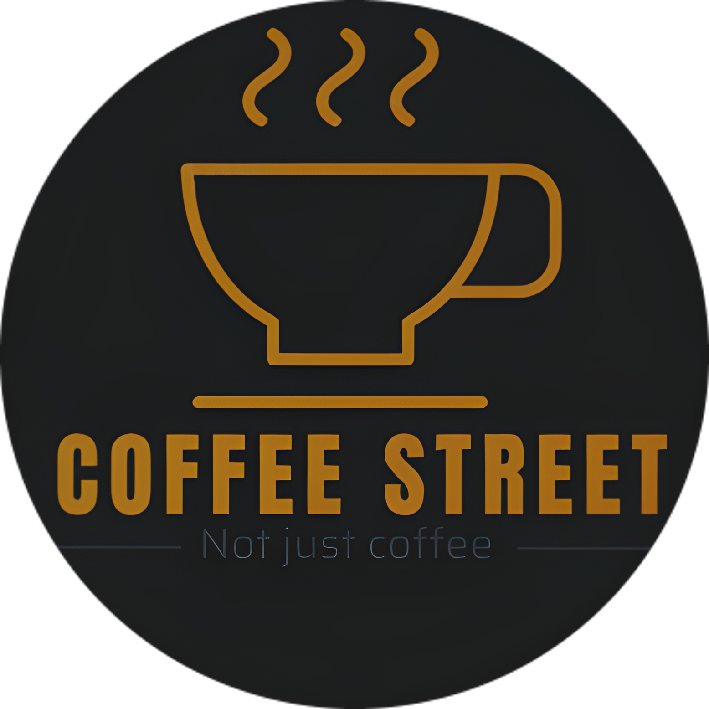

# CoffeeStreet-back-end

  

Api de proyecto final para Soy Henry - FT-29a

# Arrancar el proyecto de manera local

1. Crear una base de datos en PostgreSQL "coffee"

2. Instalar las dependencias necesarias para el correcto funcionamiento, ejecuta el comando `npm install`

3. Clonar el archivo `.env.template` y renombrarlo a `.env`

4. Una vez instalada las dependencias, se realiza la creación de las entidades con prisma. Ejecuta el siguiente comando
   `npx prisma migrate dev --name init`

\*\*\* En el caso de querer hacer un vaciado de la base de datos (borrar la carpeta de migrations), ejecuta el comando `npm run prisma-d`, para después crear ejecutar `npx prisma migrate dev --name init` (crearla de nuevo).

## Entity Relationship Diagram 📊 

## Construido con:

1. Node.js, Express, Prisma

### Rutas

---
| Método/Ruta | Necesitas | Propósito | Status |
| ----------- | --------- | --------- |------ |
| GET /products | N / a | Conseguir info de todos los productos | active |
| GET /products?name=value | name of product| Conseguir info de productos que coincidan con el name buscado | active |
| GET /products/:id | idProduct | Encuentra un producto por su id | active |
| POST /products/| info by body | Creacion de nuevo producto | active |
| PUT /products/:id | idProduct | Actualización de la data del producto segun su Id | active |
| DELETE /products/:id | idProduct | Elimina un producto por su id | active |
| GET /users | N / a | Consigue todos los Clients. | active |
| PUT /users | idUser | Actualiza el rol de un Cliente en especifico | active |
| GET /register/mail | email | Ruta para verificación de existencia de email, requiere email | active |
| DELETE /users/delete | email | Elimina usuario | active |
| POST /login | info by body | Loguea a usuario creando token | active |
| POST /login/refresh | token | Crea un nuevo token para ampliar sesión | active |
| POST /login/remove | token | Destruye sesión eliminando token | active |
| POST /login/forgot-pass | email | Envía correo para cambiar pass | active |
| POST /login/reset-pass | info by body | Cambia password | active |
| GET /order/get-all | N/A | Consigue todas las órdenes | active |
| GET /order/get-by-id | idOrder | Consigue los detalles de una | active |
| GET /order/get-by-user | idUser | Consigue todas las órdenes de cada usuario | active |
| POST /order/create | info by body | Crea una nueva órden | active |
| PUT /change-status | idOrder | Cambia el status de una órden | active |
| GET /product/discount | N/A | Consigue todos los productos que tengan discount| active |
| PUT /product/discount | idProduct | Cambia descuento o lo elimina seteandolo a null | active |
| PUT /product/stock | idProduct | Cambia stock, true o false | active |
| GET /users/favorite | idUser | Consigue todos los productos favoritos de un user | active |
| POST /users/favorite | idUser, idProduct | Anade un producto a favoritos de un usuario | active |
| DELETE /users/favorite | idUser, idProduct | Elimina un producto de la lista de favoritos de un usuario | active |
| GET /order/get-all | N/A | Consigue todas las órdenes | active |
| GET /order/get-by-id | idOrder | Consigue los detalles de una | active |
| GET /order/get-by-user | idUser | Consigue todas las órdenes de cada usuario | active |
| PUT /user/ | idUser | Actualizar usuario | active |
|GET /mercadopago |--- | ----| active |
|POST /mercadopago |---- | ----| active |
|PUT /review/update | idReview, info by body | Cambia un review | active |
|DELETE /review/remove | idReview | Elimina review | active |
|GET /review | N/A | Consigue todos los reviews | active |
|POST /review/create | info by body | Crea un review | active |
|POST /newsletter | email | Anade email en la tabla de newsletter | active |
|POST /newsletter/create | info by body | Crea y envía newsletter | active |
|DELETE /newsletter/remove | email | Eliminar email de la tabla de Newsletter | active |
---
